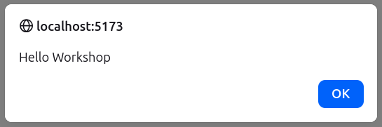

## Configurazione dell'ambiente di sviluppo

Prima di procedere con la creazione della nostra applicazione cartografica, è necessario configurare l'ambiente di sviluppo. Assicurati di avere eseguito le attività previste nella sezione ["Prima di iniziare"](setup.qmd) per Node.js. A questo punto sarà necessario configurare il nostro ambiente di sviluppo scaricando i files d'impianto [deployment.zip](/assets/deployment.zip) e decomprimendoli nella cartella di lavoro. All'interno della cartella troverai i seguenti files:

|  |  |
|----------------------------------|--------------------------------------|
| `data (dir)` | Contiene dati geospaziali di esempio |
| `examples (dir)` | Contiene esempi tratti da openlayers.org |
| `index.html` | Parte Html dell'applicazione |
| `main.js` | Parte javascript dell'applicazione |
| `package.json` | Contiene i metadati dell'applicazione e le relative dipendenze |
| `package-lock.json` | Contiene le dipendenze effettivamente installate |
| `vite.config.js` | Contiene la configurazione dell'ambiente di sviluppo |

A questo punto bisognerà inizializzare l'ambiente di sviluppo installando tutti i moduli necessari. Apriremo la finestra del terminale nella cartella di lavoro ed andremo a digitare il seguente comando

```         
npm install
```

A questo punto potremo far partire il server di sviluppo locale basato su vite.js (che impacchetta i moduli necessari e li consegna al browser) e nodejs

```         
npm start
```

Se l'installazione è avvenuta correttamente sulla console appariranno i seguenti messaggi:

```         
  VITE v3.2.11  ready in 834 ms

  ➜  Local:   http://localhost:5173/
  ➜  Network: use --host to expose
```

Questo significa che saremo in grado di eseguire l'applicazione compilata collegandoci con il browser all'indirizzo <http://localhost:5173/> in cui comparirà una finestra di alert:



A questo punto potremo sviluppare la nostra applicazione cartografica modificando opportunamente il file index.html ed il file main.js con un editor di testo.

## I concetti base di openlayers:

Prima di iniziare a lavorare con OpenLayers è bene capire i concetti chiave di OpenLayers:

| Col1 | Col2 |
|--------------------------|----------------------------------------------|
| **Map** | La *map* è un componente chiave di OpenLayers. Per un *map* da visualizzare, sono necessari una *view*, uno o più *layers* e un contenitore di destinazione. |
| **View** | La *view* determina come la mappa è renderizzata. È usata per impostare la risoluzione, le coordinate del centro, ecc. È come una camera attraverso il quale si accede al contenuto della mappa. |
| **Layers** | *Layers* possono essere alla mappa in ordine impilato, questo fa si che, i layers più in basso sono renderizzati prima dei layers più in alto. Layers possono essere sia *layers raster* (images), che *layers vettoriali* (punti/linee/poligoni). |
| **Source** | Ogni layer ha una *source*, che conosce come caricare il contenuto del layer. Nel caso di *layers vettoriali*, la sorgente è letta da dati vettoriali usando una classe *format* (per esempio GeoJSON o KML) e riempe il layer con un numero di *features*. |
| **Features** | *Features* rappresentano cose del mondo reale e possono essere renderizzate con differenti *geometries* (come punti, linee o poligoni) usando un dato *style*, che determina il suo aspetto (spessore delle linee, colore di riempiemento, etc). |

## Creare una mappa di base

Modificare il file index.html con il seguente contenuto:

``` html
<!DOCTYPE html>
<html>
  <head>
    <meta charset="utf-8">
    <title>Workshop OpenLayers - FOSS4G-IT 2026 Trento</title>
    <style>
      @import "node_modules/ol/ol.css";
    </style>
    <style>
      html, body, #map-container {
        margin: 0;
        height: 100%;
        width: 100%;
        font-family: sans-serif;
      }
    </style>
  </head>
  <body>
    <div id="map-container"></div>
    <script src="./main.js" type="module"></script>
  </body>
</html>
```

modificare poi il file main.js con il seguente contenuto:

``` javascript
import OSM from 'ol/source/OSM';
import TileLayer from 'ol/layer/Tile';
import {Map, View} from 'ol';
import {fromLonLat} from 'ol/proj';

new Map({
  target: 'map-container',
  layers: [
    new TileLayer({
      source: new OSM(),
    }),
  ],
  view: new View({
    center: fromLonLat([0, 0]),
    zoom: 2,
  }),
});
```

Osserviamo che:

- La mappa è contenuta in un'elemento <DIV> che ha l'id "map-container"

- Che lo stile definito nel codice HTML scala l'elemento a tutto schermo

- Che l'oggetto Map è definito al minimo specificando il target con "map-container" (che deve corrispondere a quello definito nella pagina HTML), un set di layers ed una view

- che l'oggetto layer contiene una sorgente dati (source)

Proviamo a:

- Localizzare la vista su Trento città

- Definire una mappa di determinate dimensioni, per esempio 600 x 600 pixel

- Analizzare errori e connessioni di rete con gli strumenti di sviluppo del browser

## Arricchicchire la mappa con informazioni personalizzate

- Aggiungiamo le informazioni relative ai confini amministrativi dei comune del Trentino (data/countries.geojson)

``` javascript
import GeoJSON from 'ol/format/GeoJSON';
import Map from 'ol/Map';
import VectorLayer from 'ol/layer/Vector';
import VectorSource from 'ol/source/Vector';
import View from 'ol/View';

// attenzione definiamo l'oggetto mappa e la assegnamo ad una variable per altri usi successivi
const map = new Map({
  target: 'map-container',
  layers: [
    new VectorLayer({
      source: new VectorSource({
        format: new GeoJSON(),
        url: './data/countries.json',
      }),
    }),
  ],
  view: new View({
    center: [0,0],
    zoom: 2,
  }),
});
```