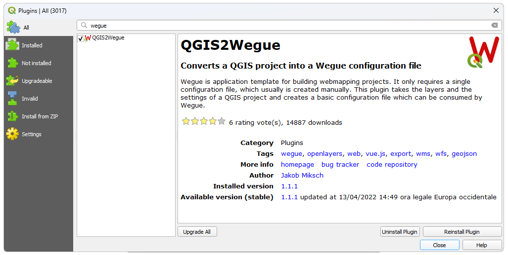
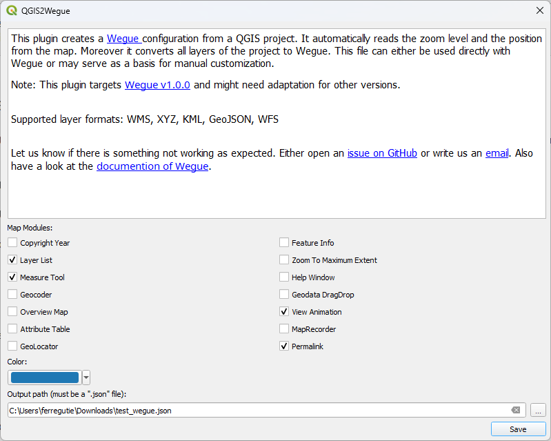
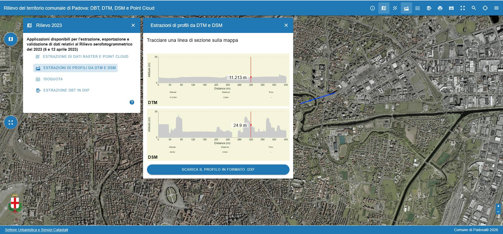

## Wegue Webgis

Wegue (WebGIS con OpenLayers and Vue) combina insieme il framework Vue.js Con Openlayers per realizzare velocemente applicazioni cartografiche. Mette a disposizione numerosi widget e controlli visuali predefiniti realizzati con il framework Vuetify. Funge da template per ridurre il lavoro d'impianto per applicazioni cartografiche basate su browser.

### Installazione

E' possibile scaricare l'applicazione dal repository di github <https://github.com/wegue-oss/wegue> direttamente sotto forma di [file .zip](git%20clone%20https://github.com/wegue-oss/wegue) oppure clonare il repository con git (usiamo per uniformità la versione 2 di wegue)

``` bash
git clone https://github.com/wegue-oss/wegue
cd wegue
git checkout v2.0.0
```

Una volta clonato o scaricato ed espanso il file zip è necessario aprire il terminale nella cartella di installazione (riferirsi a ["prima di iniziare"](setup.qmd)) ed installare i pacchetti javascript necessari:

```         
npm install
```

una volta installate le dipendenze bisogna inizializzare l'app Wegue:

```         
npm run init:app
```

ed avviare il server di sviluppo che rende disponibile in locale una versione di test dell'applicazione cartografica all'indirizzo <http://localhost:5173/>:

```         
npm run dev
```

e dovrebbe apparire la visualizzazione di default dell'applicazione:


alla fine dello sviluppo sarà necessario compilare l'applicazione per ottenere nella cartella `dist` i file da servire in produzione con un server http (apache, nginx etc...)

```         
npm run build
```

## Adattare la configurazione alle proprie esigenze

Le componenti configurabili dell'nstallazione di Wegue sono contenute nella cartella `app` il cui contenuto dovrebbe più o meno corrispondere al seguente:

```         
app
│   .gitignore
│   README.md
│   WguApp.vue
│   WguAppTemplate.vue
│
├───components
│       AppFooter.vue
│       AppHeader.vue
│       AppSidebar.vue
│       SampleModule.vue
│
├───locales
│       de.json
│       en.json
│       fr.json
│       pt.json
│
├───public
│   └───static
│       │   app-conf-minimal.json
│       │   app-conf-projected.json
│       │   app-conf-sidebar.json
│       │   app-conf.json
│       │
│       ├───data
│       │       2012_Earthquakes_Mag5.kml
│       │       shops-dannstadt.geojson
│       │
│       └───icon
│               circle.svg
│               favicon.ico
│
└───styles
        app.css
        vuetify-settings.scss
```

Per cambiare la configurazione basta modificare a nostro piacimento il contenuto di questi files, in particolare la configurazione generale di default è data dal file `public/static/app-conf.json`. Il file controlla tutto quello che può essere visto in Wegue: I vari layers, con le relative configurazioni ed in componenti dell'interfaccia utente. Il file è in formato [json](https://developer.mozilla.org/en-US/docs/Learn_web_development/Core/Scripting/JSON?utm_source=chatgpt.com) (Javascript object notation), che è il tipico formato di interscambio di dati strutturati facilmente interpretabile in javascript e *"human readable",* editabile con un editor di testo

E' particolarmente importante prestare attenzione alla sintassi del file, in quanto anche un minimo errore compromette il funzionamento dell'applicazione.

Il file app-conf.json è composto da una serie di direttive, molte delle quali opzionali. La configurazione minima prevede almeno la definizione del centro della mappa e del relativo zoom, e dei layer:

``` json
{

  "mapZoom": 6,
  "mapCenter": [1384958,5221972],

  "mapLayers": [

    {
      "type": "VECTOR",
      "lid": "Regioni",
      "url": "https://raw.githubusercontent.com/openpolis/geojson-italy/refs/heads/master/geojson/limits_IT_regions.geojson",
      "format": "GeoJSON",
      "visible": true
    },

    {
      "type": "OSM",
      "lid": "osm-bg",
      "isBaseLayer": true,
      "visible": true,
      "crossOrigin": "anonymous"
    }
  ]

}
```

### Definire uno stile per un layer vettoriale

Il layer vettoriale usa lo stile di visualizzazione di default, ma è possibile definirne uno di personalizzato aggiungendo la proprietà `style` (prestare attenzione alla virgola di separazione)

``` json
,
      "style": {
        "strokeColor": "purple",
        "strokeWidth": 3,
        "fillColor": "rgba(155,153,51,0.5)",
        "label": {
          "attribute": "reg_name",
          "outlineColor": "white",
          "outlineWidth": 2,
          "fillColor": "black",
          "offsetX": 0,
          "offsetY": 15,
          "align": "center"
        }
```

### Aggiungere un layer

E' possibile aggiungere altri layers, semplicemente inserendo dei nuovi oggetti nidificati nella lista "layers". I layers possono essere di vari tipi: VECTOR, WFS, VECTORTILE, WMS (tiled o image), WMS, XYZ, Arcgis REST:

``` json
    {
      "type": "TILEWMS",
      "lid": "carta geologica",
      "format": "image/png",
      "layers": "GE.CARTAGEOLOGICA",
      "url": "http://wms.pcn.minambiente.it/ogc?map=/ms_ogc/WMS_v1.3/Vettoriali/Carta_geologica.map",
      "transparent": true,
      "projection": "EPSG:3857",
      "attribution": "(C)Ministero ambiente",
      "isBaseLayer": false,
      "visible": false,
      "displayInLayerList": true,
      "legend": true,
      "opacityControl": true,
      "crossOrigin": "anonymous"
    },

    {
      "type": "XYZ",
      "url": "https://mt1.google.com/vt/lyrs=s&x={x}&y={y}&z={z}",
      "lid": "google satellite",
      "isBaseLayer": true,
      "visible": false,
      "crossOrigin": "anonymous"
    },
```

### Moduli aggiuntivi

E' possibile aggiungere dei moduli aggiuntivi per mezzo della sezione moduli. Andiamo ad aggiungere dopo la sezione layers la sezione moduli con i componenti dedicati alla gestione della visualizzazione dei layers(layerlist), ed all'ottenimento delle informazioni tabellari (infoclick e attributetable)

E' Importante notare che per rispettare la sintassi json va aggiunta una virgola ',' come separatore tra parametri

``` json
,
   "modules": {
       "wgu-layerlist": {
          "target": "menu",
          "win": "floating",
          "icon": "md:layers",
          "draggable": false
        },
        "wgu-infoclick": {
          "target": "menu",
          "win": "floating",
          "icon": "md:info",
          "draggable": false,
          "initPos": {
            "left": 8,
            "top": 74
          },
          "showMedia": false
        },
        "wgu-attributetable": {
          "target": "menu",
          "win": "floating",
          "icon": "md:table_chart",
          "syncTableMapSelection": true
        }
    }
```

Riassumiamo la configurazione così come definita fino a questo momento

``` json
{

  "mapZoom": 6,
  "mapCenter": [1384958,5221972],

  "mapLayers": [
    {
      "type": "VECTOR",
      "lid": "Regioni",
      "url": "https://raw.githubusercontent.com/openpolis/geojson-italy/refs/heads/master/geojson/limits_IT_regions.geojson",
      "format": "GeoJSON",
      "visible": true,
      "style": {
        "strokeColor": "purple",
        "strokeWidth": 3,
        "fillColor": "rgba(155,153,51,0.5)",
        "label": {
          "attribute": "reg_name",
          "outlineColor": "white",
          "outlineWidth": 2,
          "fillColor": "black",
          "offsetX": 0,
          "offsetY": 15,
          "align": "center"
        }
      }
    },
    {
      "type": "TILEWMS",
      "lid": "carta geologica",
      "format": "image/png",
      "layers": "GE.CARTAGEOLOGICA",
      "url": "http://wms.pcn.minambiente.it/ogc?map=/ms_ogc/WMS_v1.3/Vettoriali/Carta_geologica.map",
      "transparent": true,
      "projection": "EPSG:3857",
      "attribution": "(C)Ministero ambiente",
      "isBaseLayer": false,
      "visible": false,
      "displayInLayerList": true,
      "legend": true,
      "opacityControl": true,
      "crossOrigin": "anonymous"
    },
    {
      "type": "XYZ",
      "url": "https://mt1.google.com/vt/lyrs=s&x={x}&y={y}&z={z}",
      "lid": "google satellite",
      "isBaseLayer": true,
      "visible": false,
      "crossOrigin": "anonymous"
    },
    {
      "type": "OSM",
      "lid": "osm-bg",
      "isBaseLayer": true,
      "visible": true
    }
  ],

   "modules": {
       "wgu-layerlist": {
          "target": "menu",
          "win": "floating",
          "icon": "md:layers",
          "draggable": false
        },
        "wgu-infoclick": {
          "target": "menu",
          "win": "floating",
          "icon": "md:info",
          "draggable": false,
          "initPos": {
            "left": 8,
            "top": 74
          },
          "showMedia": false
        },
        "wgu-attributetable": {
          "target": "menu",
          "win": "floating",
          "icon": "md:table_chart",
          "syncTableMapSelection": true
        }
    }
}
```

Altre e più complesse configurazioni si possono ottenere aggiungendo altri moduli, e parametri personalizzati come da istruzioni specifiche: <https://wegue-oss.github.io/wegue/#/wegue-configuration>

## Localizzazione

La webmap può essere facilmente localizzata andando ad aggiungere un file nella cartella locales con la sigla della lingua. Per esempio nel caso si volesse localizzare in italiano si deve creare il file it.json (E' opportuno copiare il file en.json e sostituire le stringhe target in inglese, *NON LE CHIAVI!*) ed aggiungere degli opportuni parametri di controllo nel file di configurazione:

``` json
  "lang": {
    "supported": {
      "en": "English",
      "it": "Italiano"
    },
    "fallback": "it"
  },
```

## Uso di configurazioni alternative

L'applicazione consente di lavorare con differenti configurazioni. Si noti infatti che nella cartella public/static sono presenti diversi files che iniziano per app_conf e terminano per json. In questo caso è possibile richiamare le configurazioni alternative aggiungendo il parametro appCtx=\[stringa tra `app_conf-` e `.json`\]. Per esempio:

| File di configurazione in app/public/static | url |
|--------------------------|----------------------------------------------|
| app-conf.json | <http://localhost:5173/index.html> |
| app-conf-minimal.json | <http://localhost:5173/index.html?appCtx=minimal> |
| app-conf-sidebar.json | <http://localhost:5173/index.html?appCtx=sidebar> |
| app-conf-projected.json | <http://localhost:5173/index.html?appCtx=projected> |

## Sistemi di riferimento

L'applicazione gestisce nativamente le proiezioni WGS84 (EPSG:4326) e Web Mercator (EPSG:3857), in particolare la finestra di mappa, come in openlayers usa come proiezione predefinita il Web Mercator, quindi eventuali coordinate devono essere espresse in quel sistema di riferimento. E consentito usare proiezioni differenti dichiarandole nella sezione `"projectionDefs"`

``` javascript
  "projectionDefs": [
    [
      "EPSG:3003",
      "+proj=tmerc +lat_0=0 +lon_0=9 +k=0.9996 +x_0=1500000 +y_0=0 +ellps=intl +towgs84=-104.1,-49.1,-9.9,0.971,-2.917,0.714,-11.68 +units=m +no_defs"
    ],
    [
      "EPSG:32632",
      "+proj=utm +zone=32 +datum=WGS84 +units=m +no_defs"
    ],
    [
      "EPSG:25832",
      "+proj=utm +zone=32 +ellps=GRS80 +towgs84=128.8,17.85,0,0,0,0,0 +units=m +no_defs"
    ]
  ],
```

Deve essere assegnata la proiezione della finestra di mappa nella sezione `"mapProiection"`

``` json
  "mapProjection": {
    "code": "EPSG:3003",
    "units": "m",
    "extent": [1716014, 5023919, 1737137, 5038662]
  },
```

E' dopo necessario assegnare la corretta proiezione ai layer usando la proprietà `"projection"` con la sigla della proiezione definita della sezione `"projectionDefs"` Qualora non è assegnata la proiezione, viene automaticamente usata la proiezione della mappa stabilita nella sezione `"mapProiection"`

## QGIS2Wegue

Per semplificare la compilazione del file di configurazione esiste un plugin di QGIS scaricabile dal repository ufficale che si chiama QGIS2Wegue.



Una volta installato il plugin è in grado di generare una configurazione di Wegue a partire dai layers correntemente caricati nel progetto di QGIS importando al contempo la posizione iniziale della mappa ed il relativo livello di zoom. Il Plugin non è molto aggiornato (è del 2022 e genera file di configurazione compatibili con la versione 1.0.0 di Wegue ), ne sofisticato, infatti ammette solamente layers del tipo WMS, XYZ, KML, GeoJSON, WFS, non gestisce la ricollocazione delle sorgenti dati su file, non gestisce gli stili e differenti proiezioni, quindi è da considerarsi utile per ottenere iun file di configurazione da adattare e precisare manualmente.



<http://localhost:5173/index.html?appCtx=qgis> render della mappa generata con QGIS2Wegue

## Personalizzazione dell'interfaccia utente

L'applicazione è corredata a una serie di componenti di base la cui presenza nell'interfaccia è governata dalla sezione `"modules"` nel file `app-conf.json`

| Componente | identificativo | descrizione |
|----|----|----|
| [**GeoCoder**](https://wegue-oss.github.io/wegue/#/module-configuration?id=geocoder) | `wgu-geocoder` | Componente per ricercare luoghi geografici per mezzo di servizi web |
| [**GeoLocator**](https://wegue-oss.github.io/wegue/#/module-configuration?id=geolocator) | `wgu-geolocator` | Marker personalizzato per il servizio di geo coding |
| [**HelpWindow**](https://wegue-oss.github.io/wegue/#/module-configuration?id=helpwindow) | `wgu-helpwin` | Modulo per inserire una pagina di spiegazione |
| [**InfoClick**](https://wegue-oss.github.io/wegue/#/module-configuration?id=infoclick) | `wgu-infoclick` | Modulo per estrarre informazioni dai layer visibili al click sulla mappa (*carotaggio*) |
| [**LayerList**](https://wegue-oss.github.io/wegue/#/module-configuration?id=layerlist) | `wgu-layerlist` | controllo di visibilità e di opacita per i layer correntemente caricati (solo i layer non di base) |
| [**MeasureTool**](https://wegue-oss.github.io/wegue/#/module-configuration?id=measuretool) | `wgu-measuretool` | Strumento per misurazioni sulla mappa |
| [**ZoomToMaxExtent**](https://wegue-oss.github.io/wegue/#/module-configuration?id=zoomtomaxextent) | `wgu-zoomtomaxextent` | Bottone per zoomare alla massima estensione degli elementi di mappa |
| [**AttributeTable**](https://wegue-oss.github.io/wegue/#/module-configuration?id=attributetable) | `wgu-attributetable` | Tabella degli attributi dei layers vettoriali presenti in mappa |
| [**MapRecorder**](https://wegue-oss.github.io/wegue/#/module-configuration?id=maprecorder) | `wgu-maprecorder` | Registratore per realizzare storie sulla mappa |
| [**LocaleSwitcher**](https://wegue-oss.github.io/wegue/#/module-configuration?id=localeswitcher) | `wgu-localeswitcher` | Strumento per cambiare il linguaggio di localizzazione in modo interattivo |
| [**Map Overlay**](https://wegue-oss.github.io/wegue/#/reusable-components?id=map-overlay) | `wgu-map-overlay` | L'overlay è un elemento attaccato alla mappa in una precisa posizione che si sposta al cambiamento della visualizzazione, utile per annotazioni geolocalizzate |

### Moduli personalizzati

Ma L'aspetto più significativo di Wegue è la possibilità di modificare parti strutturali dell'interfaccia ed aggiungere componenti personalizzati in modo molto semplice.

Prima dell'uso, I componenti devono essere importati e dichiarati nel file `app/WguAppTemplate.vue` nella sezione `"components"`

Wegue è un'applicazione costruita sul framework [VUE](https://vuejs.org/) e sulla libreria di componenti visuali [Vuetify](https://vuetifyjs.com/) ed i componenti sono quindi implementati secondo lo standard del framework che prevede la dichiarazione in un'unico file del template visuale, del codice e dello stile CSS relativo. Wegue aggiunge poi una serie di elementi di help che consentono di usufruire dell'oggetto mappa, e quindi interagire con openlayers e l'EventBus, cioè la logica di emissione e ricezione di segnali che permette di interagire a determinate situazioni, previste dal framework o implementabili dallo sviluppatore.

Per comprendere il meccanismo di implementazione di un componente facciamo riferimento al componente di esempio che sta in app/components/SampleModule.vue ed è già precaricato di default nel file di template `app/WguAppTemplate.vue:`

``` vue
<!-- The template contains the HTML of our module  -->
<template>
  <!--  
Our module builds upon the 'wgu-module-card' it handles the integration into Wegue like adding a button in the toolbar 
-->
  <wgu-module-card
    v-bind="$attrs"
    class="sample-module"
    :icon="icon"
  >
    <!--
    Here goes the actual content of the module We use a the component 'v-card-text' from the Vuetify library
    -->
    <v-card-text>
      <!--
      Note the double curly brackets. They contain variables that dynamically change.
      The way how they change is done in the <script> part
      -->
      <b>Zoom:</b> {{ zoom }} <br />
      <b>Center:</b> {{ center }}
    </v-card-text>
  </wgu-module-card>
</template>

<script>
// the module card is a the template for a typical Wegue module
import ModuleCard from '@/components/modulecore/ModuleCard.vue';
// we import a so called "composable" that helps us to interact with the map
import { useMap } from '@/composables/Map';
// an OpenLayers helper function to display coordinates
import { toStringXY } from 'ol/coordinate';
// an OpenLayer helper function to transform coordinate reference systems
import { transform } from 'ol/proj';

export default {
  name: 'sample-module',
  inheritAttrs: false,
  components: {
    'wgu-module-card': ModuleCard
  },
  props: {
    icon: { type: String, required: false, default: 'md:star' }
  },
  // make sure to call the 'useMap' composable and return its resulting bindings
  setup () {
    const { map, layers } = useMap();
    return { map, layers };
  },
  // here we define variables that are used in the HTML above
  data () {
    return {
      zoom: '',
      center: ''
    };
  },
  watch: {
    map: {
      handler (newMap) {
        if (newMap) {
          this.onMapBound();
        }
      },
      immediate: true
    }
  },
  methods: {
    /**
     * This function is called once the map is bound to the application
     */
    onMapBound () {
      // the 'useMap' composable provides access to our OpenLayer map
      // via its returned `map` binding. Returning this binding from
      // the `setup` lifecycle hook makes it accessible via 'this.map'
      // here we get the 'view' from the map
      const view = this.map.getView();
      // we call the function to extract zoom and center from the map
      // once it is initially created
      this.extractMapViewProperties(view);
      // to ensure that we react on updates of the map,
      // we need to register a listener
      view.on('change', () => {
        // always when the map view is changing we extract
        // the current zoom and center from it
        this.extractMapViewProperties(view);
      });
    },

    /**
     * We extract the current zoom and center coordinates
     * from the OpenLayers view and store the values
     * to our module's 'zoom' and 'center' variables
     *
     * @param {ol.View} view The OpenLayers view
     */
    extractMapViewProperties (view) {
      this.zoom = Math.round(view.getZoom());

      const sourceCrs = view.getProjection();
      const targetCrs = 'EPSG:4326';

      // we transform the coordinates from the map projection to WGS84 (EPSG:3857)
      const centerTargetCrs = transform(view.getCenter(), sourceCrs, targetCrs);

      // create a readable string from the coordinates
      this.center = toStringXY(
        centerTargetCrs,
        4 // <-- number of digits after comma
      );
    }
  }
};
</script>

<!-- Here we do the styling of our module -->
<style scoped>

  /* our module has the class '.sample-module' and we reference it here */
  .sample-module.wgu-floating {
    left: auto !important;
    top: 300px !important;
    right: 10px;
  }

</style>
```

Nella configurazione di default il componente si attiva cliccando sull'icona a stella e fa comparire una finestra che contiene le informazioni di zoom e le coordinate del centro visibile della mappa, modificando le informazioni in tempo reale

## Configurazione finale

La configurazione finale dell'applicazione può essere scaricata da [qui](/assets/app.zip).

## Esempio di implementazione di Wegue

Ho utilizzato Wegue per fornire un'interfaccia per l'estrazione di dati cartografici di base relativi al comune di Padova. L'applicazione si chiama DBTMAN e consente di estrarre porzioni del rilievo in point cloud del territorio comunale, di estrarre informazioni altimetriche dal DTM e dal DSM e di esportare porzioni del DB topografico in formato CAd

<https://urbanistica.comune.padova.it/dbtman/prod/>

